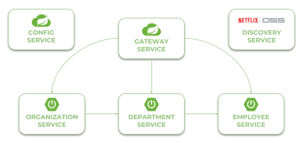

# Gateway App 
 Spring Cloud Gateway aims to provide a simple, yet effective way to route to APIs 
 and provide cross cutting concerns to them such as: security, monitoring/metrics, and resiliency)

 
* Able to match routes on any request attribute
* Predicates and filters are specific to routes
* Path Rewriting

##Tools

* JDK 1.8 or later
* Maven
* Spring Tool Suite or Intellij IDEA
* Git

##Architecture

##Configuration
The Spring Cloud Gateway provides three basic components used for configuration: 
routes, predicates, and filters. A route is the basic building block of the gateway. 
It contains the destination URI and list of defined predicates and filters. 
The predicate is responsible for matching on anything from the incoming HTTP request, 
such as headers or parameters. The filter may modify a request and response before 
and after sending it to downstream services. All these components may be set using configuration properties.

First enable integration with the discovery server for the routes by setting 
the property **spring.cloud.gateway.discovery.locator.enabled=true**.

We use the Path Route Predicate Factory for matching the incoming requests, 
and the RewritePath GatewayFilter Factory for modifying the requested path to adapt it to the 
format exposed by downstream services. The URI parameter specifies the name of target 
service registered in discovery server. Let's take a look at the following routes definition. 
For example, in order to make **patient-service** available on the gateway under the path **/patient/**, 
we should define the predicate Path=/patient/ ** , and then strip the prefix **/patient** from the path, 
because the target service is exposed under path /**. The address of target service is fetched 
for Eureka based on the URI value ***lb://organization-service***.
	
	spring:  
	 application:
	     name: gateway
     cloud:
      gateway:
       discovery:
        locator: 
         enabled: true
       routes:
       - id: patient-service #name of target service registered in discovery server
         # lb -> lodbalance
         uri: lb://patient-service
         predicates:
         - Path=/patient/**
         filters:
         - RewritePath=/patient/(?<path>.*), /$\{$path}
         
##Improves
* Hystrix Circuit Breaker integration for resiliency patterns
* API Specification with Swagger
